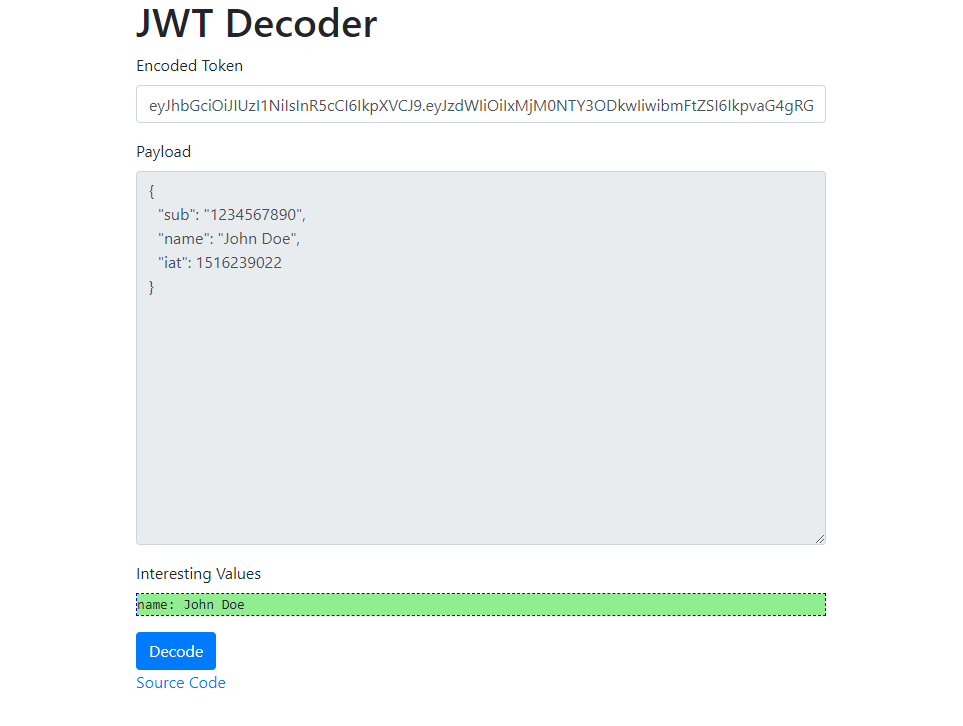

# JWT Decoder

Quick JWT decoder implemented in JavaScript using jQuery.

To get started, click on the `ghpages` link: https://gkhays.github.io/jwt-decoder/.

## Acknowledgements

Inspired by [jwt.io](https://jwt.io).
